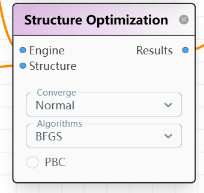

# **N103 Node: Complex Search**

## **Node Definition**

This node is used to load geometry files. Click the **UPLOAD FILES** button to upload the file.



---

## **Node JSON**

```json
{
  "id": 101,
  "title": "Structure Optimization",
  "category": "Computation",
  "subcategory": "opt",
  "node_data": {
    "input": [0, 0],
    "output": [0],
    "options": ["Normal", "BFGS", false]
  },
  "widgets": [
    {
      "optionId": 0,
      "type": "selector",
      "label": "Converge",
      "options": ["Normal", "Tight", "Loose"],
      "value": "Normal"
    },
    {
      "optionId": 1,
      "type": "selector",
      "label": "Algorithms",
      "options": ["BFGS", "LBFGS", "GPMin"],
      "value": "BFGS"
    },
    {
      "optionId": 2,
      "type": "check_box",
      "label": "PBC",
      "value": false
    }
  ],
  "connections": {
    "input": ["Engine", "Structure"],
    "output": ["Results"]
  }
}
```

---

## **Node Data Structures**

### **Inputs**

A list with two items:  

1. **Engine node data**  
2. **Structure data**: File content in `str` format  

### **Options**

A list with three items:  

1. **Convergence Criteria** (`str`):  
   - Linked to the widget **Converge**  
   - Available options: `"Normal"`, `"Tight"`, `"Loose"`  
2. **Algorithm** (`str`):  
   - Linked to the widget **Algorithms**  
   - Available options: `"BFGS"`, `"LBFGS"`, `"GPMin"`  
3. **PBC** (`boolean`):  
   - Indicates whether optimization is performed with Periodic Boundary Conditions (PBC)  

### **Outputs**

A list with one item:  

1. **Combo** (`list`): Contains the following results:  
   - **Final Results**  
   - **Trajectory**  
   - **Figures**  

---

## **TODO**

- Implement PBC option  
