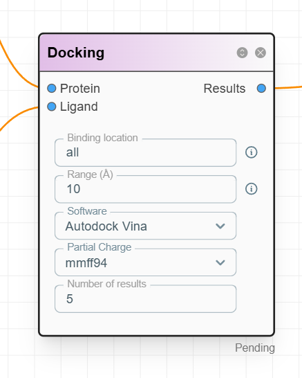

# N102 Node: Docking

## **Node Definition**

Molecular docking using Autodock Vina. 



---

## **Node JSON**

```json
{
  "id": 102,
  "title": "Docking",
  "category": "Computation",
  "subcategory":"docking",
  "file_path":"0",
  "errorinfo": " " ,
  "status": "U", 
  "node_data":{
  "input":[0,0],
  "output":[0],
  "options":["all","10","Autodock Vina","mmff94","5"]
},
  "widgets": [
    {
      "optionId":0,
      "type": "text_input",
      "label": "Binding location",
      "value": "all",
      "desc":"Enter 'all' to search the entire structure. Specify a residue like 'A 100' for the 100th amino acid in Chain A."
    },    
    {
      "optionId":1,
      "type": "text_input",
      "label": "Range (Å)",
      "value": "10",
      "desc":"A larger docking search range results in slower performance. If the binding location is set to 'all', this option will be ignored."
    },
    {
      "optionId":2,
      "type": "selector",
      "label": "Software ",
      "options": ["Autodock Vina"],
      "value": "Autodock Vina"
    },
    {
      "optionId":3,
      "type": "selector",
      "label": "Partial Charge ",
      "options": ["mmff94","eem"],
      "value": "mmff94"
    },
    {
      "optionId":4,
      "type": "text_input",
      "label": "Number of results",
      "value": "5"
    }
  ],
  "connections": {
    "input": ["Protein","Ligand"],
    "output": ["Results"]
  }
}
```

---
