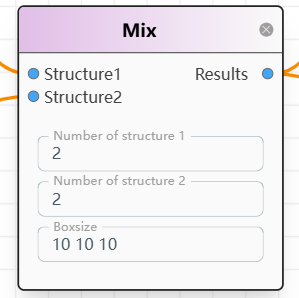

# **N103 Node: Complex Search**

## **Node Definition**

This node is for searching complex structures.



---

## **Node JSON**

```json
{
  "id": 103,
  "title": "Mix",
  "category": "Computation",
  "subcategory":"opt",
  "node_data":{
  "input":[0,0],
  "output":[0],
  "options":[ "1","1","20 20 20"]
},
  "widgets": [
    {
      "optionId":0,
      "type": "text_input",
      "label": "Number of structure 1",
      "value": "1"
    },
    {
      "optionId":1,
      "type": "text_input",
      "label": "Number of structure 2",
      "value": "1"
    },
    {
      "optionId":2,
      "type": "text_input",
      "label": "Boxsize",
      "value": "20 20 20"
    }
  ],
  "connections": {
    "input": ["Structure1","Structure2"],
    "output": ["Results"]
  }
}
```

---

## **Node Data Structures**

### **Inputs**

A list with two items:  

1. **Structure 1**: File content in `str` format  
2. **Structure 2**: File content in `str` format  

### **Options***

1. **Number of Structure 1**: integer
2. **Number of Structure 2**: integer
3. **Boxsize**: (X, Y, Z), float

### **Outputs**

A list with one item:  

1. **Combo** (`list`): Contains the following results:  
   - **Final Results**  
   - **Trajectory**  

---

## **TODO**

- Implement PBC option  
