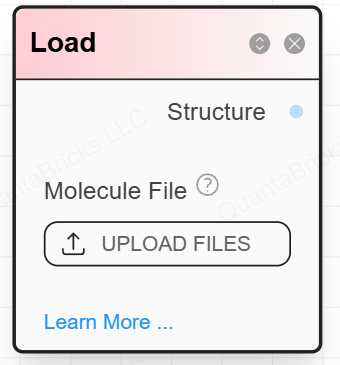

# **N1 Node: Load Molecules Nodes**

## **Node Definition**

This node is used to load geometry files. Click the **UPLOAD FILES** button to upload the file.



---

## **Node JSON**

```json
{
  "id": 1,
  "title": "Load Molecule",
  "category": "Load",
  "subcategory": "molload",
  "node_data": {
    "input": [0],
    "output": [0],
    "options": [false]
  },
  "widgets": [
    {
      "type": "file_selector",
      "label": "Molecule File",
      "value": ""
    },
    {
      "optionId": 0,
      "type": "check_box",
      "label": "Add Hydrogen",
      "value": false
    }
  ],
  "connections": {
    "input": [],
    "output": ["Structure"]
  }
}
```

---

## **Node Data Structures**

### **Inputs**

- **None**  

### **Options**

A list with one item:  

1. **Add Hydrogen** (`boolean`):  
   - Indicates whether to add hydrogen atoms to the molecule  

### **Outputs**

A list with one item:  

1. **Structure Data** (`str`): File data  

---

## **TODO**

- Implement hydrogen addition  
