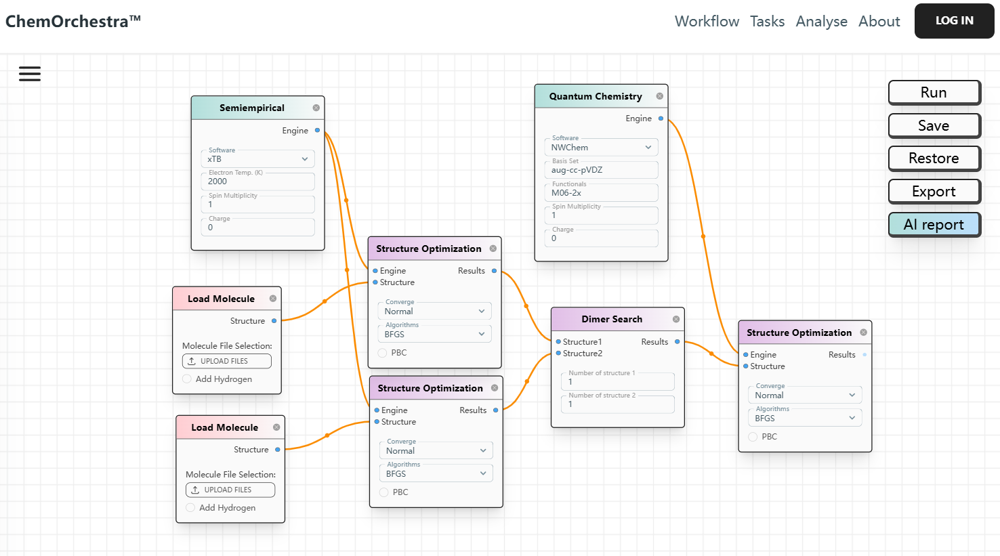

# Definition of Nodes

This document serves as the manual for various nodes in **Product ChemOrchestra™**. Each node performs specific functions within the computational workflows.

## Workflow Overview

## Nodes

[Details to be added]

## Edges

[Details to be added]

## General Rules

For **geometry optimization** and **MD simulation**:

- All results should be packaged in a list.
- The first item in the list must always be the final structure.
- The second item in the list must always be the trajectory. If the trajectory size exceeds 100 MB, the second item should also be the final structure.

Front-end and back-end components are linked using a RESTful API.

The back-end must:

- Have one-to-one corresponding node definitions. [**To Do**]
- Include validation functions to ensure workflows can execute properly and return the required resources. [**To Do**]

## Integrated Software

- xTB

- Packmol

- openbabel

- Autodock Vina
